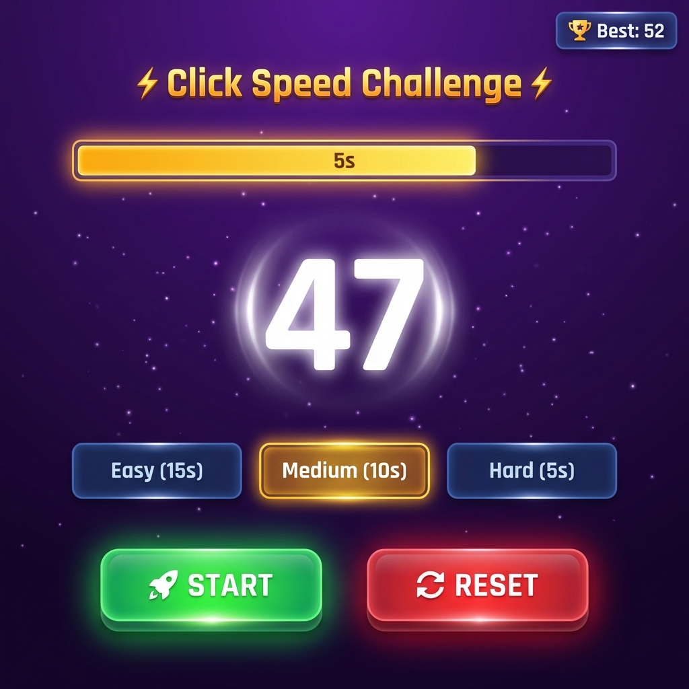

# ⚡ Click Speed Challenge ⚡

A fast-paced, addictive clicking game built with React! Test your clicking speed and compete against yourself.

<p align="center">
  
</p>

---

## 🎮 Features

| Feature | Description |
|---------|-------------|
| ⏱️ **Multiple Difficulty Levels** | Easy (15s), Medium (10s), Hard (5s) |
| 🏆 **High Score Tracking** | Your best scores are saved locally |
| ⌨️ **Keyboard Support** | Press SPACEBAR to click faster! |
| ✨ **Smooth Animations** | Pulse effects, glowing buttons, floating particles |
| 🎉 **New Record Celebration** | Rainbow animation when you beat your high score |
| 📱 **Responsive Design** | Works on desktop and mobile |

---

## 🚀 How to Play

1. **Select Difficulty** - Choose Easy, Medium, or Hard
2. **Press START** - The countdown begins!
3. **Click as fast as you can** - Or use SPACEBAR
4. **Beat your high score** - Can you get 50+ clicks in Hard mode?

> 💡 **Pro Tip**: Use your spacebar for faster clicks - it's easier than mouse clicking!

---

## 🛠️ Installation

```bash
# Clone the repository
git clone <repo-url>

# Navigate to the project
cd counter-game/counter-game

# Install dependencies
npm install

# Start the development server
npm start
```

Open [http://localhost:3000](http://localhost:3000) to play!

---

## 🎨 Tech Stack

- **React** - UI Framework
- **CSS3** - Modern styling with animations
- **LocalStorage** - High score persistence

---

## 📊 Scoring Levels

| Clicks | Rating |
|--------|--------|
| 0-20 | 🐢 Beginner |
| 21-35 | 🚶 Average |
| 36-50 | 🏃 Fast |
| 51-70 | ⚡ Lightning |
| 70+ | 🔥 Legendary |

---

## 🎯 Challenge Yourself!

Can you achieve **70+ clicks** in 10 seconds? Share your high score!

---

<p align="center">
  Made with ❤️ and React
</p>
